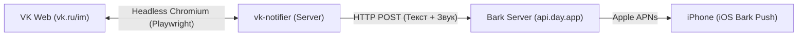

# VK to iOS Push Notifier 📲

[](https://www.python.org/)
[](https://playwright.dev/)
[-000000?logo=apple&logoColor=white)](https://github.com/Finb/Bark)
[](LICENSE)

Автономный сервис для мгновенной доставки Push-уведомлений о личных сообщениях, беседах и статусе «печатает» из ВКонтакте на iPhone через Apple Push Notification service ([Bark](https://github.com/Finb/Bark)).

---

## 💡 Зачем этот проект?

Осенью 2026 года ВКонтакте окончательно заблокировал сторонние токены приложений (Kate Mobile, VFeed и др.) с постоянной ошибкой `Flood Control (code: 9)`. Официальные токены VK Admin привязаны к IP браузера и живут не более 24 часов (`code: 1130`), что делает классические боты на базе VK API непригодными для личных уведомлений.

**VK to iOS Notifier** решает эту проблему в корне:
* Работает напрямую с защищенной веб-версией `vk.ru/im` через оптимизированный **headless Chromium** ([Playwright](https://playwright.dev/)).
* Не требует ввода логина и пароля в открытом виде — авторизация проходит в 1 клик через **QR-код** и официальное приложение VK на телефоне (с полной поддержкой 2FA).
* Отправляет пуши через открытый легковесный протокол **Bark** прямо в системный шлюз Apple APNs — телефон получает пуш мгновенно даже при выгруженном приложении, экономя заряд аккумулятора.

---

## ⚡️ Возможности

* 💬 **Мгновенные уведомления о ЛС и беседах** — имя собеседника / название чата и превью текста сообщения.
* ✍️ **Статус «печатает...»** — отдельный мягкий пуш с кулдауном 3 минуты на диалог, чтобы не спамить.
* 🖼 **Поддержка эмодзи и вложений** — корректный парсинг `alt`-тегов эмодзи, стикеров, фото и голосовых.
* 🛡 **Умная дедупликация (`seen_cache.json`)** — исключает повторные пуши при перезапуске сервера или службы.
* ⏱ **Фильтрация времени** — отсекает относительные плашки (`только что`, `· 2м`), исключая ложные триггеры.
* 🚫 **Игнорирование исходящих** — сообщения, отправленные вами (`Вы: ...`), не порождают уведомлений.
* ⚙️ **Минимальные ресурсы** — потребление ~450–480 МБ RAM и ~1% CPU на сервере.

---

## 🏗 Архитектура



---

## 📋 Системные требования

* **ОС:** Linux (Ubuntu 20.04+, Debian 11+), macOS или любая машина с поддержкой Python и Chromium.
* **Python:** 3.10 или новее.
* **iPhone:** iOS 14.0+ с установленным бесплатным приложением [Bark](https://apps.apple.com/app/bark-customed-notifications/id1403753865) из App Store.
* **Сертификаты:** Корневые сертификаты Минцифры РФ (для беспрепятственного соединения с доменами VK).

---

## 🚀 Быстрый старт

### 1. Клонирование и установка зависимостей

```bash
git clone https://github.com/your-username/vk-ios-notifier.git
cd vk-ios-notifier

# Установка Python пакетов
pip install -r requirements.txt

# Установка headless Chromium и системных библиотек Playwright
playwright install chromium
playwright install-deps chromium
```

> **Примечание по сертификатам (для РФ серверов):**  
> Убедитесь, что в системе установлены доверенные сертификаты (`ca-certificates`). При необходимости добавьте сертификаты Russian Trusted Root CA.

---

### 2. Настройка Bark на iPhone

1. Установите приложение **Bark** из App Store.
2. Откройте приложение и скопируйте персональный ключ устройства (`Device Key`).
3. Создайте файл конфигурации `.env` на основе примера:
   ```bash
   cp .env.example .env
   nano .env
   ```
4. Вставьте ваш ключ:
   ```env
   BARK_KEY=ваш_bark_key
   ```

---

### 3. Авторизация по QR-коду

Запустите скрипт авторизации:

```bash
python3 qr_auth.py
```

1. Скрипт запустит браузер и сохранит изображение QR-кода в `qr.png`.
2. Отсканируйте QR-код в мобильном приложении VK:
   **Сервисы ➔ Настройки (шестерёнка) ➔ QR-код ➔ Сканировать**.
3. Если включена двухфакторная аутентификация (2FA), введите одноразовый код из SMS/приложения прямо в терминал.
4. После подтверждения авторизованная сессия сохранится в файл `session.json`.

---

### 4. Тестовый запуск

Запустите службу в консоли:

```bash
python3 web_notifier.py
```

Отправьте себе тестовое сообщение во ВКонтакте с другого аккаунта или попросите друга написать вам. На iPhone должен мгновенно прийти нативный Push-уведомление! Для остановки нажмите `Ctrl + C`.

---

## 🖥 Настройка автозапуска через systemd

Для непрерывной фоновой работы оформите сервис как системного демона:

1. Скопируйте шаблон сервиса:
   ```bash
   cp vk-notifier.service.example /etc/systemd/system/vk-notifier.service
   ```
2. При необходимости отредактируйте пути к директории репозитория и интерпретатору Python:
   ```bash
   nano /etc/systemd/system/vk-notifier.service
   ```
3. Активируйте и запустите службу:
   ```bash
   systemctl daemon-reload
   systemctl enable vk-notifier
   systemctl start vk-notifier
   ```

### Полезные команды управления

* **Просмотр логов в реальном времени:**
  ```bash
  journalctl -u vk-notifier -f
  ```
* **Проверка статуса:**
  ```bash
  systemctl status vk-notifier
  ```
* **Перезапуск сервиса:**
  ```bash
  systemctl restart vk-notifier
  ```

---

## 📊 Потребление ресурсов

| Параметр | Ожидание | Момент получения сообщения / Пуша |
|---|---|---|
| **RAM** | ~450–480 МБ (Python + Headless Chromium) | ~485 МБ |
| **CPU** | 1–2% одного ядра vCPU (интервал 2.5 с) | Краткий всплеск до 15% на 0.2 с |

---

## 🔒 Безопасность и приватность

* **Все данные хранятся только у вас:** Пароли нигде не сохраняются, авторизация держится в локальном файле `session.json`.
* **Никаких сторонних облаков:** Содержимое сообщений передается напрямую между вашим сервером, шлюзом Bark/APNs и вашим личным iPhone.
* **Защита в Git:** Файлы `session.json`, `seen_cache.json`, `.env` и скриншоты по умолчанию добавлены в `.gitignore`.

---

## 📄 Лицензия

Распространяется под лицензией [MIT](LICENSE).
